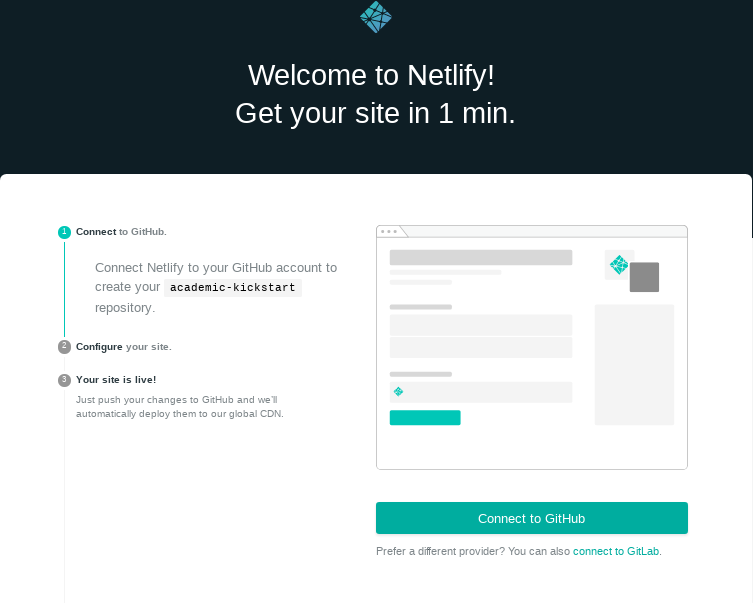

+++
title = "Thoughts on creating this website"
subtitle = "What worked and what didn't in the process of creating my website based on a Hugo theme"

# Add a summary to display on homepage (optional).
summary = ""

date = 2019-03-13T05:29:01+01:00
draft = true

# Authors. Comma separated list, e.g. `["Bob Smith", "David Jones"]`.
authors = ["admin"]

# Is this a featured post? (true/false)
featured = false

# Tags and categories
# For example, use `tags = []` for no tags, or the form `tags = ["A Tag", "Another Tag"]` for one or more tags.
tags = []
categories = []

# Projects (optional).
# projects = ["internal-project"]

# Featured image
# To use, add an image named `featured.jpg/png` to your page's folder. 
[image]
  # Caption (optional)
  caption = ""

  # Focal point (optional)
  # Options: Smart, Center, TopLeft, Top, TopRight, Left, Right, BottomLeft, Bottom, BottomRight
  focal_point = ""
+++

# Building this website using github, Rstudio, hugo and Netlify

This website was built using the Hugo theme ["academic"](https://sourcethemes.com/academic/). 
Hugo is a way to built static sites (not dynamic where the content is created each time a visitor opens the website).
This theme is great and very rich with features. I will describe the process I went through to get this site up and running. 

tl/dr - If you want to serve the site on [Netlify](https://www.netlify.com/) - use [academic kickstart](https://sourcethemes.com/academic/docs/install/#install-with-web-browser) and add content from there. See section XX for what I actually did. 

Previously I had used [Weebly](https://www.weebly.com/) to build my website and while I enjoyed this platform for its ease of use and nice design, I felt that it was time for something different (more why?). While attending [OpenCon Switzerland](https://openconswiss.github.io/) I participated in a [workshop](https://openconswiss.github.io/schedule/#session-14) on creating websites via Github with hugo themes with [Joao Martins](https://twitter.com/rambujo) where I got quite excited about the possibilities available with Hugo. 
When I decided to rebuild my website I was convinced that I was going to use the [blogdown R package](https://bookdown.org/yihui/blogdown/) which allows you to create websites using Rmarkdown with Hugo.

My path was not quite as straightforward as I had imagined, but nevertheless here is how I got to this edition of my website. 

## First Attempt:

Started out reading directions on blogdown page and it seemed straightforward enough to follow the [workflow proposed on the blogdown site](https://bookdown.org/yihui/blogdown/workflow.html).

1. Scrolled through various [hugo themes](https://themes.gohugo.io/) and settled on the [hugo-academic theme](https://sourcethemes.com/academic/).
2. Then from the RStudio console I ran `install.packages("blogdown")` to install blogdown and then `blogdown::install_hugo()` to install Hugo which is used to serve the site locally.
3. Ran `blogdown::new_site("gcushen/hugo-academic")` to create my new site. 

I didn't document it well, but I ran into some problems with this attempt where I actually had the default hugo-lithium theme instead of my desired hugo-academic theme. I decided to start over to keep things from getting too complicated. 

## Second attempt:
1. In RStudio I started a new project ("File->New Project") where I chose "New Directory" and then "Website using blogdown". 
Like the first attempt this autogenerated some content for a basic website and this enabled me to play around with the directory structure of how these sites are formatted. I learned that generally the documents that are edited are in /content, the static content that is formatted is in /static and some of the configuration is found in /config. I was also able to play around with some of the functionality in RStudio where from the "Addins" menu you can easily spin up a preview of the site and create new blog posts.

However,  I was still not getting my theme of choice to work. Nevertheless I wanted to see if I could get the site up and running on my custom domain.

2. Created a git repo in my website directory (`git init`) and added files in my website directory (`git add `), commited these files (`git commit -m "trying out this hugo stuff"`) and then pushed to github. 
3. Then I logged into Netlify, clicked on "new site from git", then clicked on github, authorized Netlify to access my repositories, found my repository, chose the basic settings and then deployed. This gave me a netlify site address, but I wanted to use my custom domain. I followed the [steps Netlify outlines](https://www.netlify.com/docs/custom-domains/) where you add you can assign your custom domain to your deployed netlify site and configure your DNS provider to redirect to the netlify servers. It took about a day after configuring with my DNS provider (GoDaddy) for my website to be available via my custom domain. 

So this was a good start: I have a website served by Netlify available on www.juliagustavsen.com. However, I was still not able to use the theme I desired.

## Third attempt:

This time I decided to rtfm for using academic with  RStudio. So I created a fresh directory and fresh git repo and used the directions from the theme on how to use this theme with Rstudio.

1. Use the directions on the theme [website for installing with Rstudio](https://sourcethemes.com/academic/docs/install/#install-with-rstudio)
2. Copy the config.toml from default up to config.toml in root of the website directory. 
3. Copy the content/ folder in /themes/academic/exampleSite/ to my root /content folder which enabled me to get started with the site and adding my content.
4. I tested out the site now and then by clicking the RStudio button "Addins -> Serve Site", then clicking to view this in my browser. 
5. I added my files to my git repo (not the same repo as in second attempt) and then pushed to Github
6. I added the Github repo in Netlify and then when it was building the site I ran into all kinds of errors while building.
+. One was because I did not have the correct version of hugo specified, and this could be fixed by adding a netlify.toml file to the root of my website and specificying that I would like to use Hugo verison 53. 
+. Another error occurred when Netlify could not find the [hugo-academic theme. ](https://github.com/gcushen/hugo-academic/issues/395). It turns out that the theme is supposed to live as a git submodule in the themes directory and I did not have the submodule configured properly. I briefly tried adding it using a .gitsubmodules file, but this did not work for me. I played around with this for a little bit, but decided to try another approach. 

## Fourth attempt

Use the netlify one-click method. This is finally what has worked for me. After my previous attempt 

1. Clicked on this link to deploy an example site, "Academic Kickstart" on Netlify [Install Academic with Netlify](https://app.netlify.com/start/deploy?repository=https://github.com/sourcethemes/academic-kickstart). This worked very easily. I left the address as a Netlify address while I worked on various changes. . You have the option to change the repository name now (or you can do it later as I did). This option creates a git repository under your connected user in github that you will use to add content to your website. Doing things this way made it easy to make sure that everything was properly set up to work with Netlify.
A little bit later I changed address where the site was deployed to my custom address. Since I had already set up my DNS for Netlify (in above Attempt two) I was able to see my deployed site immediately on my custom domain.
2. With the site successfully deployed on Netlify, I cloned the git repository to a new directory on my laptop (I left the other failed attemps aside).
3. In Attempt three I had created content (e.g. biography, publications, experience and presentations) based on the example site and I had set up the menus and website settings so I copied these two folders to my new "academic kickstart" folder and then worked from there.
4. I noticed the themes directory was empty and remembered that the academic theme is pulled in as a submodule, so I ran `git submodule update --init --recursive` to get the files from the theme into my local directory. This is necessary for serving the website locally (on your computer), but also useful if you are making changes or customisations to the layout and need to copy some files to your root.
Before this, I did not know anything about [submodules in git](https://git-scm.com/book/en/v2/Git-Tools-Submodules) but I was happy to learn about this slick way to store one separate repository within another. 
5. Now this version was not quite set up to work out of the box with Rstudio.- cannot currently use the Rstudio functionality  of New post or serve site because I do not have a config.yaml. I chose to serve the site from the command line and then work on files to quickly see that I was not breaking anything(unclear). - when testing out things it was easier to have a site running "hugo server" from a terminal and the site loaded. This way it was quick to see if there was a problem and to diagnose it from the command line. By this I mean that there were helpful error or warning messages displayed. The RStudio plugins were handy, but at this point I was getting a bit impatient to get my site up and running so I forged ahead using my text editor and command line. 
6. For adding (my few) publications I chose the list style (after trying all of them) which I liked, but was frustrated that the journal name and year of the publication were not visible from the main page. I customized the layout so that that was visible by copying /themes/academic/layouts/partials/li_list.html to my website root /layouts/partials/li_list.html and edited this file so that I could see the date and journal name. I am still not completely satisfied with the publication list style, but will do more updates at a later date. 
7. I thought it might be fun to add a few pages in French to my website since Hugo offers the ability to create sites in multiple languages.  The Hugo academic site has [some instructions] (https://sourcethemes.com/academic/docs/language/) on getting this set up, but it took me a few attempts to actually get things working. My default page is in ENglish (as defined in config/_default/config.toml defaultContentLanguage = "en")
- I copied the yaml files for my desired languages from /themes/academic/i18n/
 to a new directory /i18n. These provide the website interface in different languages and work quite nicely. 
- In /config/_default/languages.toml I added a second section for French by using the example that was contained in this file.
With Hugo you can either keep all of your multiligual content in separate folders (e.g. in my case, content/en and content/fr) or you can keep all of the content in one folder (content/) and use the language codes to identify which files are in which languages (e.g. experience.md which is in English, the default language and experience.fr.md which is in French). The option that worked best for me was to keep all the files in content/ and then create the translated content.  
- I ran into some problems getting my biography (served from content/admin/ ) in two languages. With this theme and the way that I am using it, much of the biography info comes from the "admin" user profile that lives in /content/admin/_index.md and then this is referenced by a widget using /content/home/about.md. If I just added a new file about.fr.md in content/home/ my website crashed. What finally worked (by trying and error), was moving /content/admin/_index.md to /content/admin/_index.en.md, adding  /content/admin/_index.fr.md, moving /content/home/about.md to /content/home/about.en.md and then adding /content/home/about.fr.md. So what I ended up with for my bio files was:
/content/admin/_index.en.md
/content/admin/_index.fr.md
/content/home/about.en.md
/content/home/about.fr.md
-Then things worked quite well and the order of files for the French content was turned on and off and ordered using the same parameters as the English content (e.g. for the .fr.md files in /content/home the "active = true" needs to be set and the weight for its position in the page). The top menu bar content for French is organized in config/_default/languages.toml.
-Apparently in the config.toml you can [add a line to disable a language](https://gohugo.io/content-management/multilingual/#disable-a-language), so this could be useful if working on a tranlation. To disable French and Japanese you would add :  disableLanguages = ["fr", "ja"] 
8.  I also wanted to change the default website icon (fav icon which is seen in Chrome in the lefthand part of the tab) from the academic theme "A" to something more personalized for my site. To do this I followed the instructions on the [theme website](ttps://sourcethemes.com/academic/docs/customization/#website-icon) which instructed to have a 16x16 pixel icon as icon.png and another 192x192 pixel icon as icon-192.png in the root static/img folder. I created my icons in Illustrator and placed the icons in static/img but I was not able to change the website icon this way. Based on a [github issue](https://github.com/gcushen/hugo-academic/issues/454) I saw that what could work was creating a public/img folder from my website root and putting the icons there. This worked!
9. Since working on this blog post I found that the fonts seemed a bit too large for me and so I scaled down the fonts by copying the font for the overall theme that I am using ("default", not "classic" or "playfair") from /themes/academic/data/fonts/default.toml to a new folder /data/fonts/default.toml. Here I changed the font size from 20 to 16 and the small font size from 16 to 14. 
10. In the publication section when you looked at each individual publication there were all these buttons for sharing these items on twitter, reddit, facebook, etc. and I didn't want these buttons so in config/_default/params.toml I set sharing = false (by default it is set to true) which removed the buttons.

## For the future
- Currently there are still things that I would like to change and adapt for this website, but for now I am going to release it into the wild and come back to it later.
-At a later date I would like to:
1. improve the publication format. I find the information does not scan quickly.
2. Add some nice pictures to my website
3. Presentations: Update the format to be a bit more structured. 

## Conclusion:

It was super useful to create this website with a Hugo theme, but, for my specific desires, it was not as straightforward as I thought it would be (and especially when I didn't read all of the possible instructions before starting), but in the end I have a website that I am happy with. I am very appreciative of all of the nice work that has gone into the Academic Hugo theme. 
